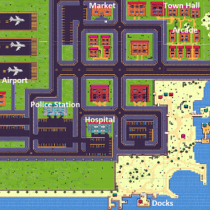
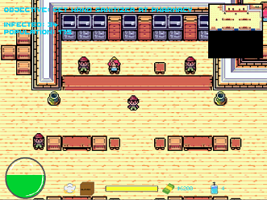
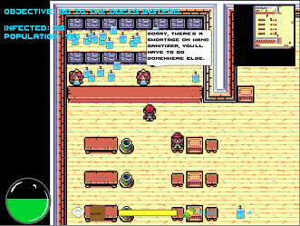
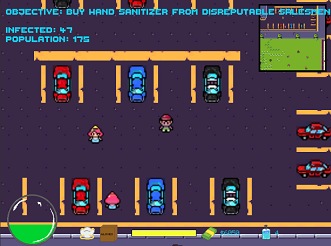
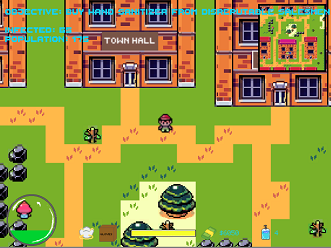

# R(Nought): Covid-19

## Play Now

[Final Project Demo Release](https://connect.unity.com/mg/other/r-nought-covid-19-5)

ScreenShot1.png
## Screen Shots



)



## Game Description

R Nought, in epidemiology, "is the number of cases, on average, an infected person will cause during their infectious period. “ (source 1) What this game does, is pits the protagonist against a growing number of Covid-infected tourists in a hot vacation spot on the coast. The protagonist cannot afford to purchase an early plane ticket home and must do everything in their power to protect themselves as they earn cash and get out of town before they contract the virus. Players will avoid burglars, purchase, and find protective gear, and do whatever it takes to buy that plane ticket. R Nought incorporates mechanics that encourage players to practice social distancing and allows for various playstyles to either speed run the game and compete for the fastest time or hang out an explore the chaotic town.


## Overview
```
Title: R Nought
Tagline: “Hey! That is not 6 feet, get away!”
Genres: RPG, Single Player Game, Survival, Simulation Game
Platforms: PC (Mobile later)
Target Audience: PC and Mobile players of ages 16+ that enjoy Pokemon-esq games 
Plays Like: Pokemon 
Goal: Avoid contracting a disease and get out of town/
```
## Major Mechanics:
```
-    Square Tiled map
-    8-direction character movement
-    Obtaining wealth to purchase items
-    Purchasing from vendors
-    Viral Load Meter that fills when contracting virus
-    NPCs infect each other with the virus naturally
-    NPCs infect players within “6 feet” of them
```

## Key Experiences
```
-    Barely avoiding contracting the disease
-    Escaping a robber
-    Finding a new obtainable upgrade
-    Managing economy
```

## Selling Points
```
-    Convenient gameplay experience that has unique elements and is fun and sometimes strategic
-    Allows for exploration
```

## Credits
### Ryan Larson
Email: rlarso@uw.edu

### Primary Role:
  - Map Designer 
  - NPC logic implementation
  - Story Development
  - Pixel Art Asset Desiger
  - Component Testing
  - NPC Behavior Scripting
  - Player Behavior Scripting


### Bio: 
  - University of Washington Computer Science and Software Engineering Senior
  - Map Design Enthuesiest
  - Futurist
  - Optimization Fanatic


### Eyas Rashid
Email: erashid@uw.edu

### Primary Role:
  - Audio Design
  - Project Management
  - User Interface Design
  - Integration Testing
  - Animation Specialist
  - Conceptual Design
  - Dialogue Implementation


### Bio: 
  - University of Washington Computer Science and Software Engineering Senior
  - Anti-social Gamer
  - Plant Enthusiast
  - Mountaineer
  - Foodie
  - Coffee addict


